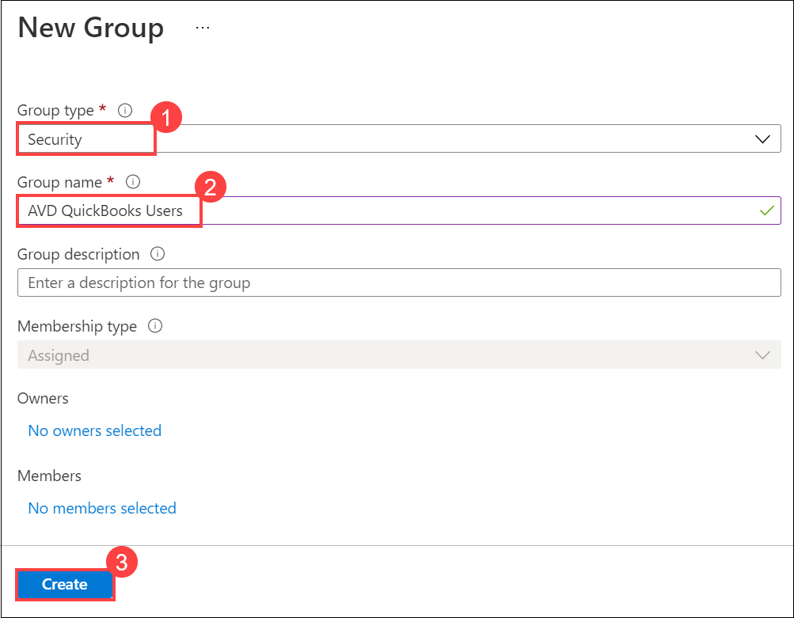
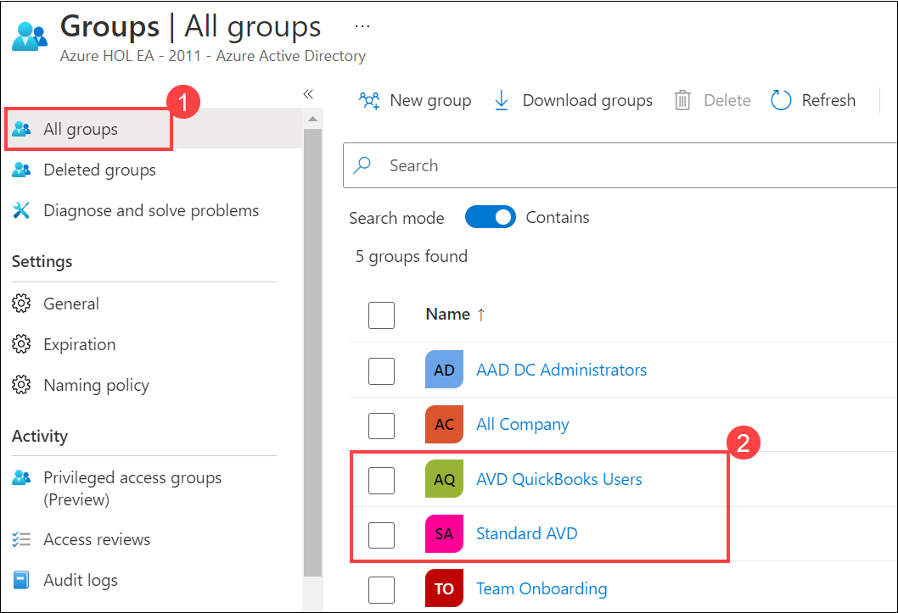
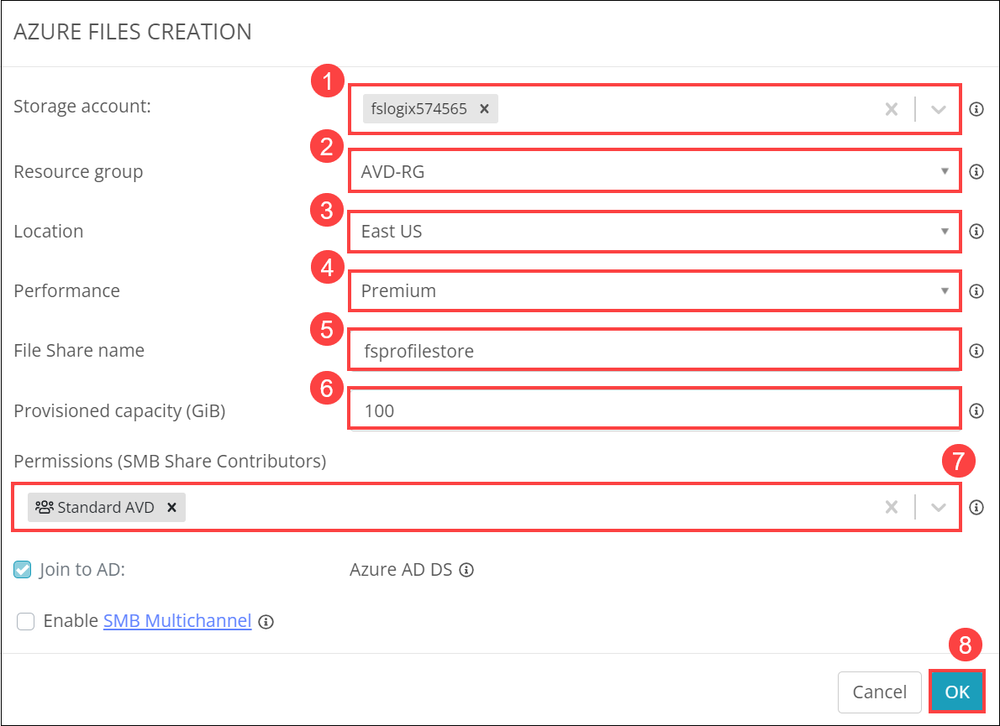

# Lab 1: Configure NMM and Create NMM Account

## Overview

Azure AD Security Groups are Security Principals, which means they can be used to secure objects in Azure AD. They can be created natively in Azure AD, or synced from Windows AD with Azure AD Connect. NMM Partner API allows MSPs to automate various actions in NMM via API that they can do via the NMM portal. For examples, MSPs can create & manage host pools, hosts, desktop images all via the API. In this lab, you'll be creating groups in Azure AD, accessing the NMM portal using the web app and creating a NMM Account.

## Exercise 1: Create Groups in Azure AD.

In this exercise, you'll be creating two security groups from Azure Active Directory by logging into the Azure Portal.

1. Navigate to the Azure portal, then search for **Active Directory** in the search bar and select **Azure Active Directory** from the suggestions.

    
    
2. You will be directed towards the Azure Active Directory **Overview** window.

    
    
3. Click on the **Groups** tab under the **Manage** blade.

    
    
4. Click on the **New Group**.

    
    
5. Select the Group type as **Security**, name it **Standard AVD** and click on **Create**. Your group will be created successfully.

    

6. Again click on **New Group**.

    

7. Select the Group type as **Security**, name it **AVD QuickBooks Users** and click on **Create**. Your group will be created successfully.

    
    
8. Now in the Groups window that comes up, under **All Groups**, you will be able see the two newly created groups named **Standard AVD** and **AVD QuickBooks Users**.

    

## Exercise 2: Getting started with NMM

In this exercise, you'll be accessing the NMM portal using the web app, registering for **Nerdio Manager for MSP** with the help of Powershell commands and creating your own **NMM Account** from the **NMM Portal**.

1. On the **Azure portal** search for **Resource groups** in the search bar (1) and select **Resource groups** (2) from the suggestions.

   
   
1. Select **NMM-RESOURCES-RG** from the list of reosurce groups which is a dynamic RG created during creation NMM resource. It contains all the required resources.

   
   
1. Select the **App service** from the list of resources.

   
   
1. From the App service page, Select the **URL** of the web page to access the Nerdio portal.

   
   
1. From the Web page, **Copy** *(1)* the PowerShell command and store it in Notepad which you'll be using it later and click on **Launch Azure Cloud Shell** *(2)*
 
   
   
1. Once the Cloud Shell launches, Click on **Show advanced settings** to configure a new storage account.
    
   
   
1. Use existing **JumpVM-RG** for the resource group. Create new storage account as **storage<inject key="DeploymentID" enableCopy="false" />** and blob storage as **blob**. 

   
   
1. Once the Cloud Shell is configured, Paste the **PowerShell command** which you copied earlier and press enter.

   

   >**NOTE**: The execution of the command will take 5 - 10 minutes to complete. Wait till the execution completes.

1. Navigate back to the previous tab and refresh the web page. Click on **Accept** to provide the neccessary permissions.

   
   
1. Please provide the following details in the registartion page

   - **Company**: Select the default subscription *(1)*
   - **Name**: odl_user_<inject key="DeploymentID" /> *(2)*
   - **Email**: **<inject key="AzureAdUserEmail" />** *(3)*
   - **Country**: Select your country *(4)*
   
   Click on **Register**.
   
   
   
1. Once registered, You'll land up in **NMM portal**. Click on **Add account** to create new NMM account.

   
   
1. Provide the following details to create the account.

   **A. STEP 1: LINK TO CUSTOMER'S AZURE AD ACCOUNT**
   
   - **Grant access to Azure AD Tenant**: Click on *Connect (1)*. Login into your Azure account and click on **Accept** to provide the neccessary permission.

     
     
     
     
   - **Account name**: Leave it to default value *(2)*
   - **Desktop deployment model**: Select *Azure Virtual Desktop (3)* 
   - **Select subscription**: Select the default subscription from the drop down *(4)*
   - **Indicate your Active Directory setup**: Select *Use Existing Azure AD DS* from the drop down *(5)*
   
   Select **Save & next** *(6)* and wait till the configuration completes.
   
   
   
   **B. STEP 2: NETWORKING**
   
   - **Select Azure region**: *East US (1)*
   - **Select or create Resource Group**: *AVD-RG (2)*
   - **Select network**: *aadds-subnet(10.0.0.0/24) (3)*
   
   Select **Save & next** *(4)* and wait till the configuration completes.
   
   
   
   **C. STEP 3: ACTIVE DIRECTORY - EXISTING AZURE AD DS**
   
   - **Domain name**: NAME OF THE AD DS
   - **Domain admin user (must have domain join rights)**: <inject key="Username" />
   - **Domain admin password**: <inject key="Password" />

   Select **Save & next** *(4)* and wait till the configuration completes.
   
   
   
   **D. STEP 4: FSLOGIX STORAGE**
   
   Select **Create new Azure Files share** and provide the following details to create new storage account for FSLogix.
   
   
   
   - **Storage account**: fslogix{deploymentid}
   - **Resourec group**: *AVD-RG*
   - **Location**: *East US*
   - **Performance**: *Premium*
   - **File Share name**: *fsprofilestore*
   - **Provisioned capacity(GiB)**: *100*
   - **Permissions (SMB Share Contributor)**: *Standard AVD*
   - Click on *OK*

   
   
   Select **Save & done** and wait till the configuration completes.
   
   
  
1. Once the storage account is created. You'll be able to see your NMM account in the Accounts blade.

   

1. Click on the Next button present in the bottom-right corner of this lab guide.
