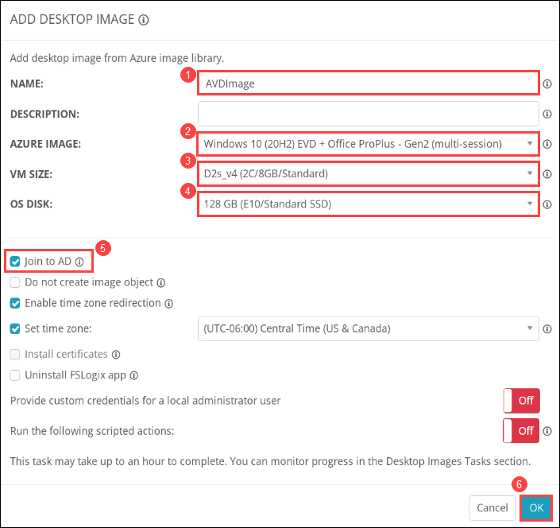

# Lab 2: Create Desktop Image and Host pool

## **Overview**

NMM Partner API allows MSPs to automate various actions in NMM via API that they can do via the NMM portal. For examples, MSPs can create & manage host pools, hosts, desktop images all via the API.

## Exercise 1: Create Desktop Image

1. From the NMM portal, Click on **Accounts** *(1)* from the side blade and click on **Manage** *(2)* on your default NMM Account which you created in Lab 1.

   
   
1. Select **DESKTOP IMAGES** *(1)* from the side blade and click on **Add from Azure library** *(1)* to create a new image.

   
   
1. Provide the following details to create the new desktop image.

   - **NAME**: *AVDImage (1)*
   - **AZURE IMAGE**: *Windows 10 (20H2) EVD + Office ProPlus - Gen2 (mutlsession) (2)*
   - **VM SIZE**: *D2s_v4 (2C/8GB/Standard) (3)*
   - **OS DISK**: *128GB (E10/Standard SSD) (4)*
   - Check ***Join to AD*** *(5)*
   - Click on ***OK*** *(6)*

   
   
   >**NOTE**: Image creation will take 40 - 45 minutes. Please wait untill it completes.
   
1. Once the image creation is completed. You'll be able to see the image in the Desktop image side blade.

   
   
## Exercise 1: Create Host Pool

1. 
   
