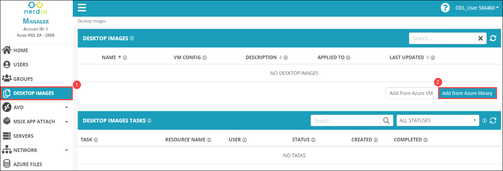

# Lab 2: Create Desktop Image for AVD

## **Overview**

NMM Partner API allows MSPs to automate various actions in NMM via API that they can do via the NMM portal. For examples, MSPs can create & manage host pools, hosts, desktop images all via the API.

## Exercise 1: Create Desktop Image

1. From the NMM portal, Click on **Accounts** *(1)* from the side blade and click on **Manage** *(2)* on your default NMM Account which you created in Lab 1.

   
   
1. Select **DESKTOP IMAGES** *(1)* from the side blade and click on **Add from Azure library** *(1)* to create a new image.

   
   
1. Once the 
   
