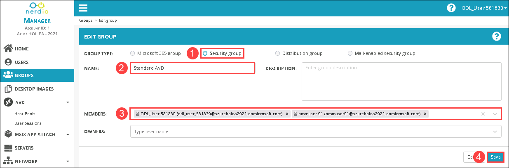
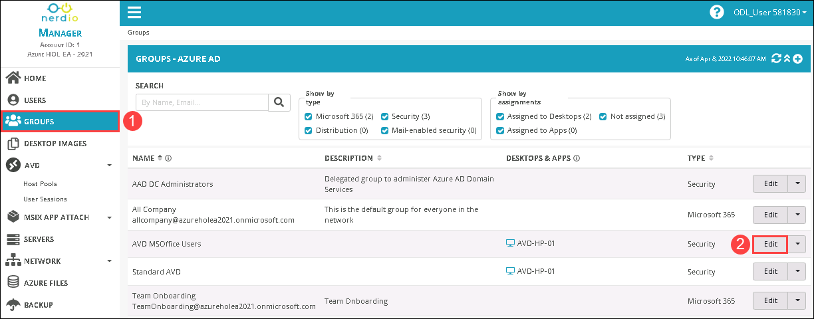
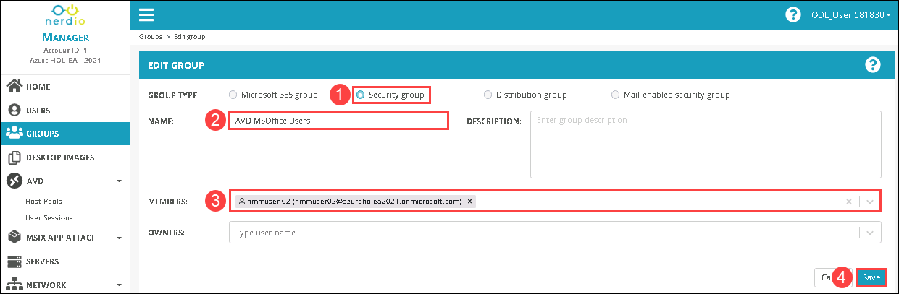
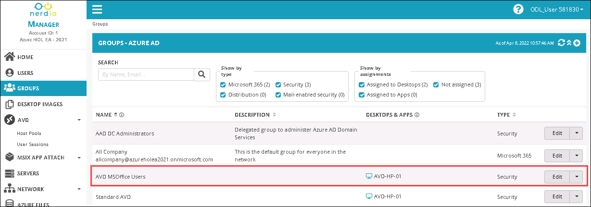

# Lab 3: Create users and assign users to security groups

## Overview

A security group can have users, devices, groups, and service principals as its members and users and service principals as its owners. NMM Portal lets us create users and security groups and also gives us the liberty to assign the users to a group for further configurations. In this lab, you'll be creating new users in your NMM Account and assigning them to an Azure AD security group.

## Exercise 1: Create new users for AVD

In this exercise, We'll be creating new users for assigning them to the existing security group in order to access the AVD environment.

1. Select **USERS** ***(1)*** from the left-hand side blade and click on **Add users** ***(2)***.

   
   
1. Provide the following details to create a new user, and click on **Save** ***(5)***.

   - FIRST NAME: **nmmuser** ***(1)***
   - LAST NAME: **01** ***(2)***
   - PRIMARY EMAIL ADDRESS: **nmmuser01** ***(3)***
   - USERNAME: Select the **Make username as primary email address** ***(4)*** check box 

   
   
1. **Copy** ***(1)*** the password and paste it into a notepad as it is required for later labs, and click on **Ok** ***(2)***.

       
   
1. . Click on **Add users**, to create another user.

   
   
1. Provide the following details to create a new user, and click on **Save** ***(5)***.

   - FIRST NAME: **nmmuser** ***(1)***
   - LAST NAME: **02** ***(2)***
   - PRIMARY EMAIL ADDRESS: **nmmuser02** ***(3)***
   - USERNAME: Check the **Make username as primary email address** ***(4)***

   
   
1. **Copy** ***(1)*** the password and paste it into a notepad as it is required for later labs, and click on **Ok** ***(2)***.

   
   
1. Once the user creation is completed. You'll be able to see new users on the **USERS** page in the NMM portal.

   
   
## Exercise 2: Assign new users to security group

In this exercise, We'll be assigning the new users to a security group.

1. In NMM portal, Select **GROUPS** ***(1)*** from the left-hand side blade and then click on **Edit** ***(2)*** next to the **Standard AVD** group.

   
   
1. Provide the following details to add users to the group, and click on **Save** ***(4)***

   - GROUP TYPE: **Security group** ***(1)***
   - NAME: **Standard AVD** ***(2)***
   - MEMBERS: Select **<inject key="AzureAdUserEmail" enableCopy="false" />**, and **<inject key="Nmm User 01" enableCopy="false" />** ***(3)*** from the drop down
   
   
   
1. Once the users are added to the **Standard AVD** group, click on the **drop-down** icon next to the edit button of the Standard AVD group and select the **Manage AVD desktops** option.

   
   
1. Under **DESKTOP ASSIGNMENTS**, Select the **AVD-HP-01** ***(1)*** host pool and click on **Confirm** ***(2)***.

   
   
1. Once the Desktop assignment completes, you'll be able to see the **Standard AVD** group attached to the **AVD-HP-01** desktop host pool.

   
   
1. From NMM portal, Select **GROUPS** ***(1)*** from the left-hand side blade and then click on **Edit** ***(2)*** next to the **AVD MSOffice Users** group.

   
   
1. Provide the following details to add users to the group, and click on **Save** ***(4)***

   - GROUP TYPE: **Security group** ***(1)***
   - NAME: **AVD MSOffice Users** ***(2)***
   - MEMBERS: Select **<inject key="Nmm User 02" enableCopy="false" />** ***(3)*** from the drop down
   
   
   
1. Once the users are added to the **AVD MSOffice Users** group, click on the **drop-down** icon next to the edit button of the Standard AVD group and select the **Manage AVD desktops** option.

   
   
1. Under **DESKTOP ASSIGNMENTS**, Select the **AVD-HP-01** ***(1)*** host pool and click on **Confirm** ***(2)***.

   
   
1. Once the Desktop assignment completes, you'll be able to see the **AVD MSOffice Users** group attached to the **AVD-HP-01** desktop host pool.

   
   
1. Click on the **Next** button present in the bottom-right corner of this lab guide.

    
