# Lab 3: Create users and groups in NMM portal

## Overview

A security group can have users, devices, groups and service principals as its members and users and service principals as its owners. NMM Portal lets us create users and security groups and also gives us the liberty to assign the users to a group for further configurations. 

## Exercise 1: Create new users for AVD

In this exercise, you'll be creating new users by specifying their credentials in your NMM Account.

1. From the NMM portal, Click on **Accounts** *(1)* from the side blade and click on **Manage** *(2)* on your default NMM Account which you created in Lab 1.

   

1. Select **USERS** *(1)* from the side blade and click on **Add users** *(2)* to create a new image.

   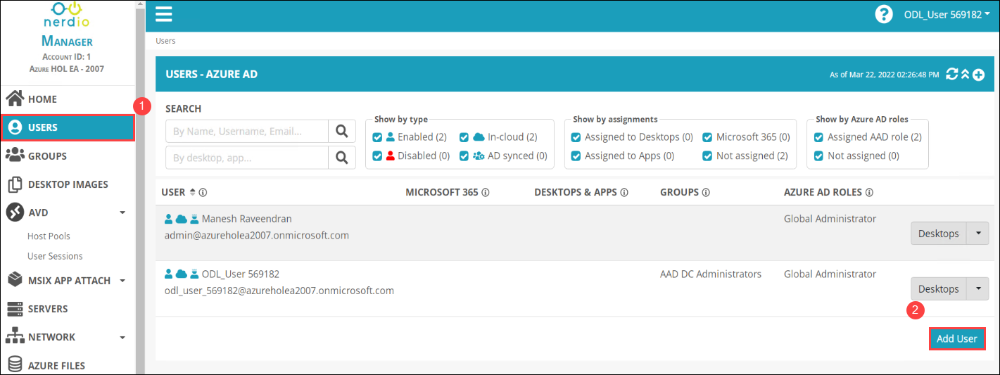
   
1. Provide the following details to create the new user.

   - **FIRST NAME**: *nmmuser (1)*
   - **LAST NAME**: *01 (2)*
   - **PRIMARY EMAIL ADDRESS**: *nmmuser01 (3)*
   - **USERNAME**: Check the *Make username as primary email address (4)*
   - Click on ***OK*** *(5)*

   
   
1. **Copy and save** *(1)* the user's password in a notepad which you'll be using later and click on **Ok** *(2)*.

   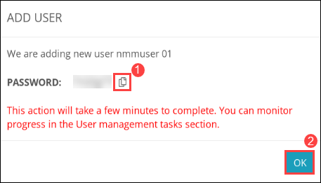    
   
1. Similarly, Let's create another user. Select **USERS** *(1)* from the side blade and click on **Add users** *(2)* to create a new image.

   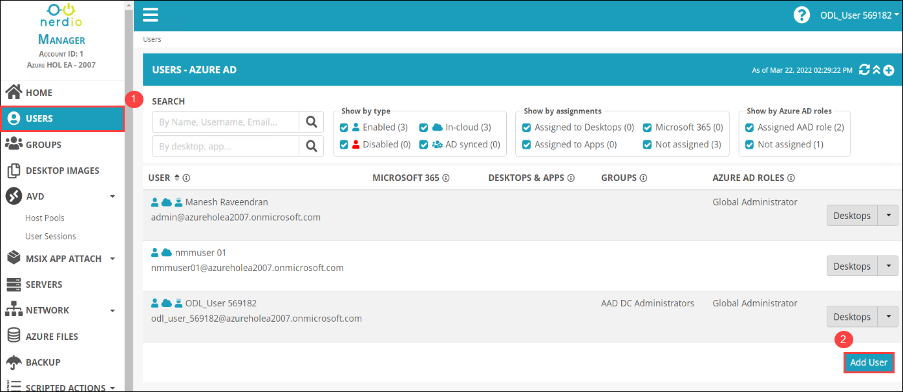
   
1. Provide the following details to create the new user.

   - **FIRST NAME**: *nmmuser (1)*
   - **LAST NAME**: *02 (2)*
   - **PRIMARY EMAIL ADDRESS**: *nmmuser02 (3)*
   - **USERNAME**: Check the *Make username as primary email address (4)*
   - Click on ***OK*** *(5)*

   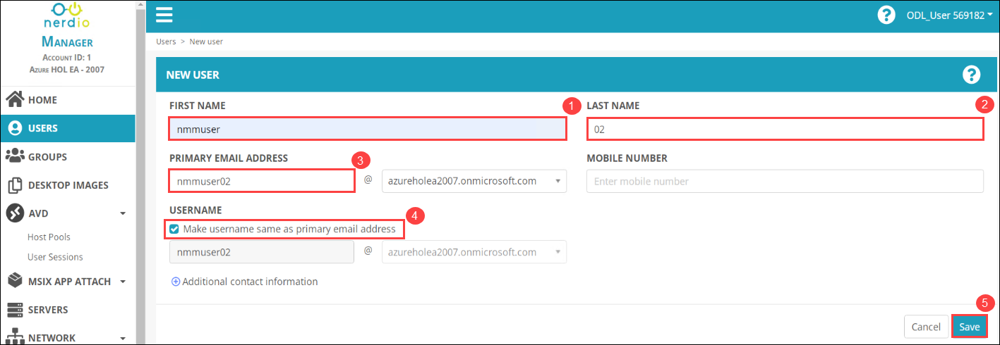
   
1. **Copy and save** *(1)* the user's password in a notepad which you'll be using later and click on **Ok** *(2)*.

   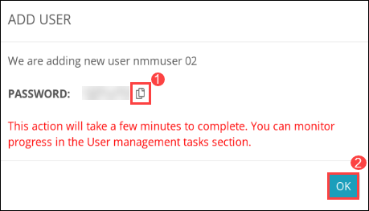
   
1. Once the user creation completes. You'll be able to see new users in the **USERS** page in NMM portal.

   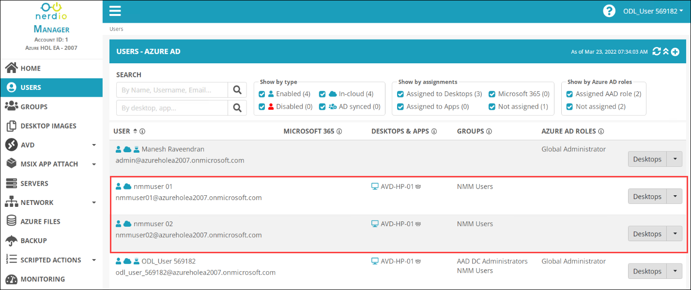
   
## Exercise 2: Assign new users to security group

In this exercise, you'll be assigning the new users that you recently created to a security group in your NMM Account.

1. From the NMM portal, Click on **Accounts** *(1)* from the side blade and click on **Manage** *(2)* on your default NMM Account which you created in Lab 1.

   

1. Select **GROUPS** *(1)* from the side blade and click on **Edit** *(2)* of the **Standard AVD** group to add new users to the group.

   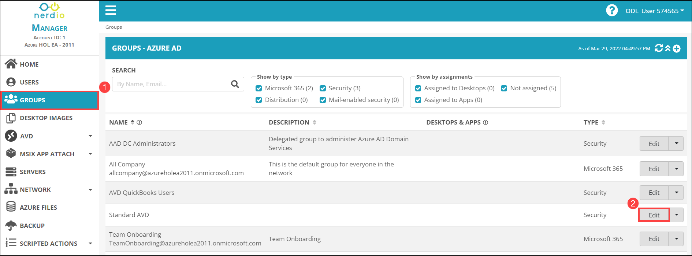
   
1. Provide the following details to add users to the group.

   - **GROUP TYPE**: *Security group (1)*
   - **NAME**: *Standard AVD (2)*
   - **MEMBERS**: Select *ODL_User, nmmuser01. nmmuser02 (3)* from the drop down
   - **OWNERS**: Select *ODL_User (4)* from the drop down
   - Click on ***Save*** *(5)*
   
   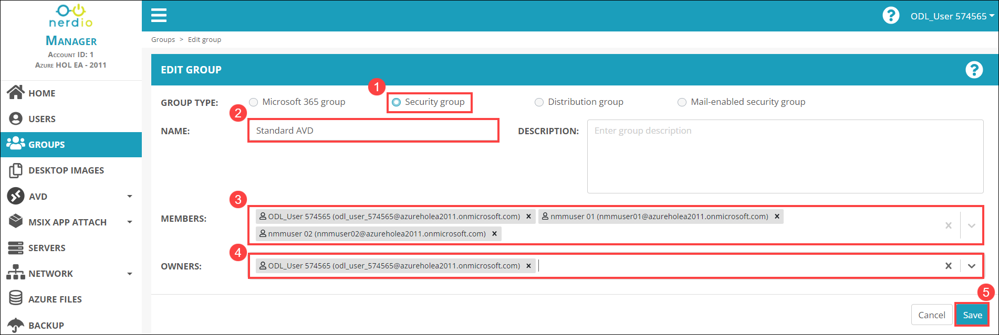
   
1. Once the new users are added to the **Standard AVD** group, cLick on the **drop down** icon of Standard AVD group and select the **Manage AVD desktops** option.

   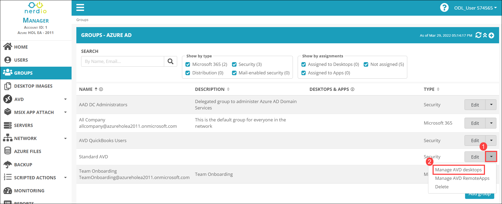
   
1. In **DESKTOP ASSIGNMENTS** page, Select the default **AVD-HP-01** *(1)* desktop host pool and click on **Confirm** *(2)*.

   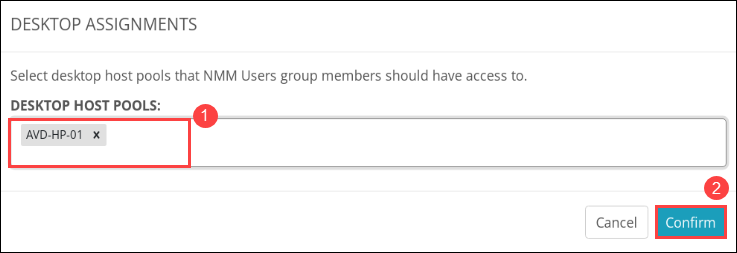
   
1. Once the Desktop assignment completes, you'll be able to see the **Standard AVD** group attached to the **AVD-HP-01** desktop host pool.

   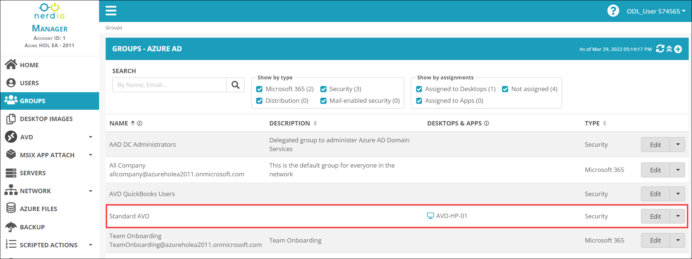
   
   
    
