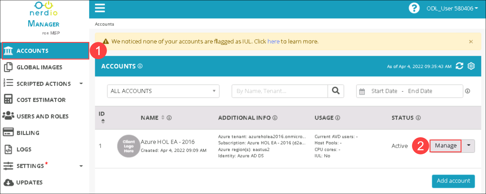
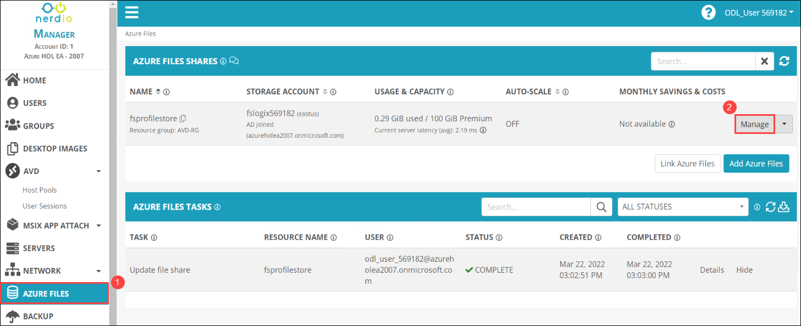
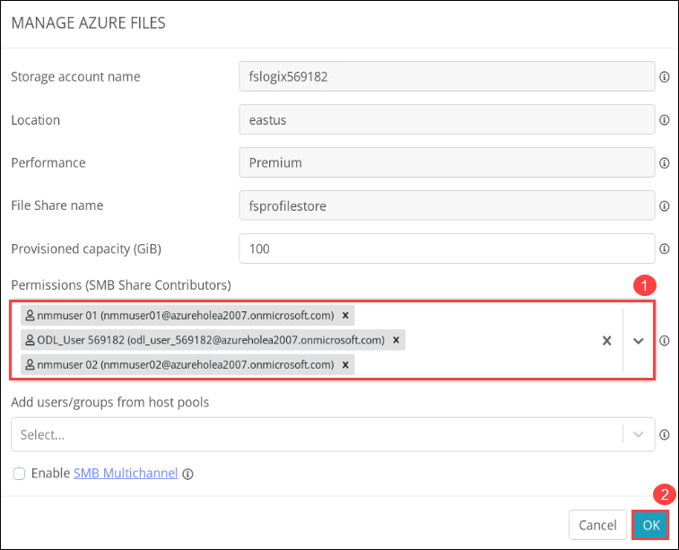
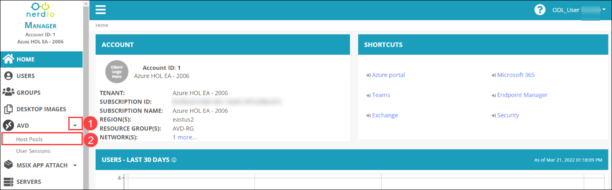
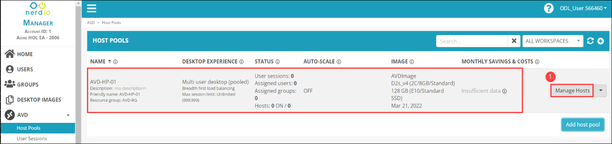

# Lab 3: Create users and groups in NMM portal

## **Overview**


## Exercise 1: Create new users for AVD

1. From the NMM portal, Click on **Accounts** *(1)* from the side blade and click on **Manage** *(2)* on your default NMM Account which you created in Lab 1.

   
   
1. Select **AZURE FILES** *(1)* from the side blade and click on **Manage** *(2)* to create a new image.

   

1. In Permissions (SMB Share Contributors), Add **nmmuser01** and **nmmuser02** *(1)* from the drop down and click on **OK** *(2)*.
   
   
   
1. From your NMM account home page, Expand the **AVD** *(1)* drop down and Select **Hostpool** *(2)*.

   
   
1. You'll be able to see the **AVD-HP-01** in the host pool side blade. Click on **Manage** *(1)*.

   
   
1. Click on the **drop down** icon of first session host and click on **Restart**

   
   
1. Similarly, **Restart** the second session hosts and waiting till the Restart task completion.
  
   

## Exercise 2: Access the Desktop using AVD Desktop Client

In this exercise, we will access the Desktop and RemoteApps assigned to us in the previous exercise using the AVD Desktop client.

>#### **Note:** You have to perform this exercise in **Your Own PC/computer/workstation.** Do not perform this exercise within the JumpVM.

1. Open a browser in **Your Own PC/computer/workstation** (not within the JumpVM), copy and paste the following URL in that browser tab.

   ```
   https://docs.microsoft.com/en-us/azure/virtual-desktop/connect-windows-7-10#install-the-windows-desktop-client
   ```

   > **Note:** To download *AVD Mac Client* on **macOS**, use the link given below:
   >
   > ```
   > https://docs.microsoft.com/en-us/azure/virtual-desktop/connect-macos
   > ```

2. Under *Install the Windows Desktop Client*, click on **Windows 64-bit**. This will download the **Remote Desktop Client** on **Your Own PC/computer/workstation**.
   
   
      
3. After the download completes, open the setup to run it. Then on the Welcome page of setup click on **Next**.

4. Check the agreement box and click on **Next**.

5. On the **Installation scope** window select **Install just for you** and then click on **Install**.

   

6. After installation, in your PC go to **Start** and search for **Remote desktop** and open the remote desktop application with the exact icon as shown below.

   
   
7. Once the application opens, click on **Subscribe**.

   
  
8. Enter your **credentials** to access the workspace.

   - Username: *Paste your username* **<inject key="AzureAdUserEmail" />** *and then click on **Next**.*
   
   

   - Password: Paste the password of ***nmmuser01*** which you had copied earlier *and click on **Sign in**.*

   
   
   >**Note:** If there's a popup entitled **Help us protect your account** click **Skip for now (14 days until this is required)**

   

   Make sure to **uncheck** *Allow my organization to manage my device* and click on **No, sign in to this app only**.

   
   
10. The AVD dashboard will launch, then double click on the **Excel** application to access it.

    
    
11. A window saying *Starting your app*, will appear. Wait for a few seconds, then enter the password of ***nmmuser01*** which you had copied earlier and click on **OK**.
   
    
    
12. Wait for the Session Desktop to connect.

    
    
4. Your virtual desktop will launch and look similar to the screenshot below. You can exit from the window by clicking on **X *i.e., the close button***. 
        
      
     
5. Click on the **Next** button present in the bottom-right corner of this lab guide. 
    
