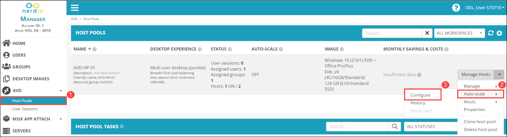
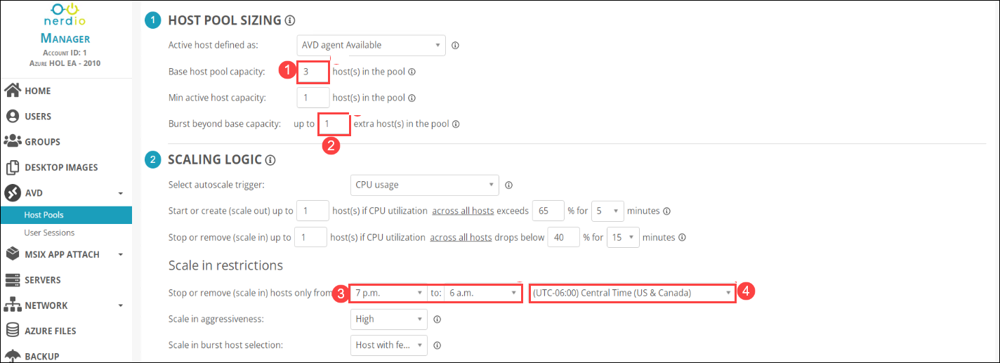
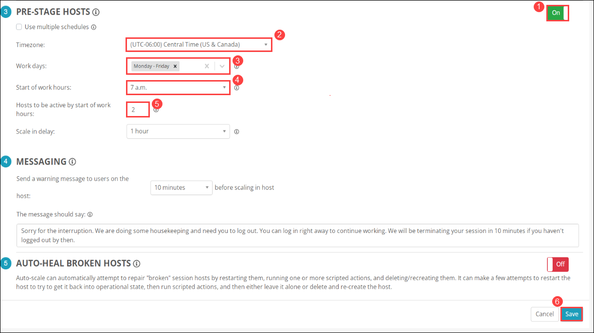

# Lab 5: Configure Auto Scaling

## Oerview

The autoscale feature lets you scale your **AVD Host Pools** up or down to optimize deployment costs. Based on your needs, you can make a scaling plan based on time of day, specific days of the week and session limits per session host. In this lab, you'll be configuring auto-scalling of the AVD host pool in your NMM Account. 

## Exercise 1: Configure Auto Scaling

In this exercise, you'll be configuring auto-scalling of an existing AVD Host Pool in your NMM Account.  

1. From the NMM portal, Click on **Accounts** *(1)* from the side blade and click on **Manage** *(2)* on your default NMM Account which you created in Lab 1.

   
   
1. From your NMM account home page, Expand the **AVD** *(1)* drop down and Select **Hostpool** *(2)*.

   

1. From the Host pool page *(1)*, Select **Auto-Scale** *(2)* from the drop down and click on **configure** *(3)*.

   
   
1. In **HOST POOL SIZING**, Set **Base host pool capacity** to **3** *(1)* and set **Burst beyond base capacity** to **1** *(2)*. In **SCALING LOGIc**, Set **Stop or remove (scale in) hosts only from** ***7 p.m. to 6 a.m.***. Select your default time zone.

   
   
1. In **PRE-STAGE HOSTS, provide the following the details to pre stage the hosts and **AUTO-HEAL BROKEN HOSTS** and understand the rules. Leave all the values to **Defaults**.

   - **Enable** the **PRE-STAGE HOSTS** option
   - **Timezone**: *Select your default time zone. (2)*
   - **Work days**: *Monday-Friday (3)*
   - **Start of work hours**: *7 a.m. (4)*
   - **Hosts to be active by start of work hours**: *2 (5)*
   - Click on ***Save*** *(6)*

   
   

