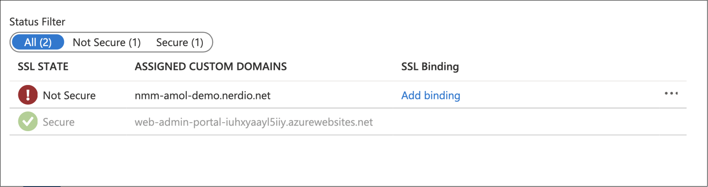
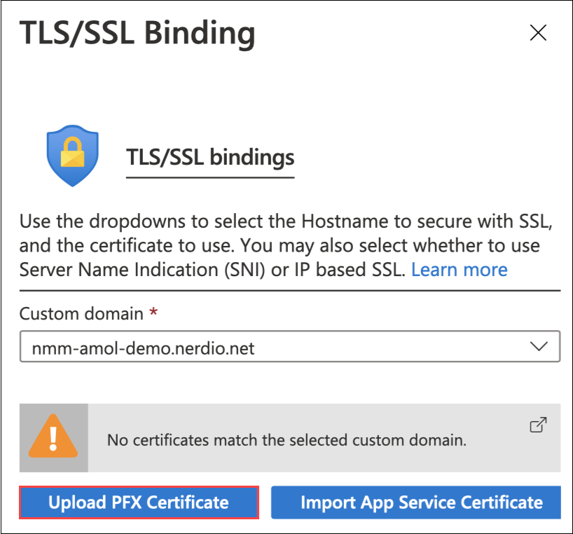
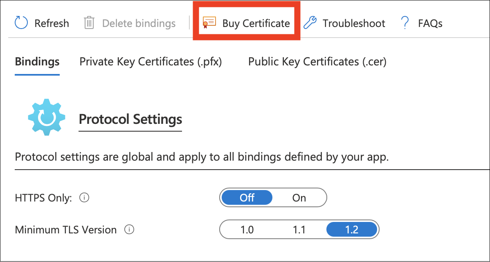
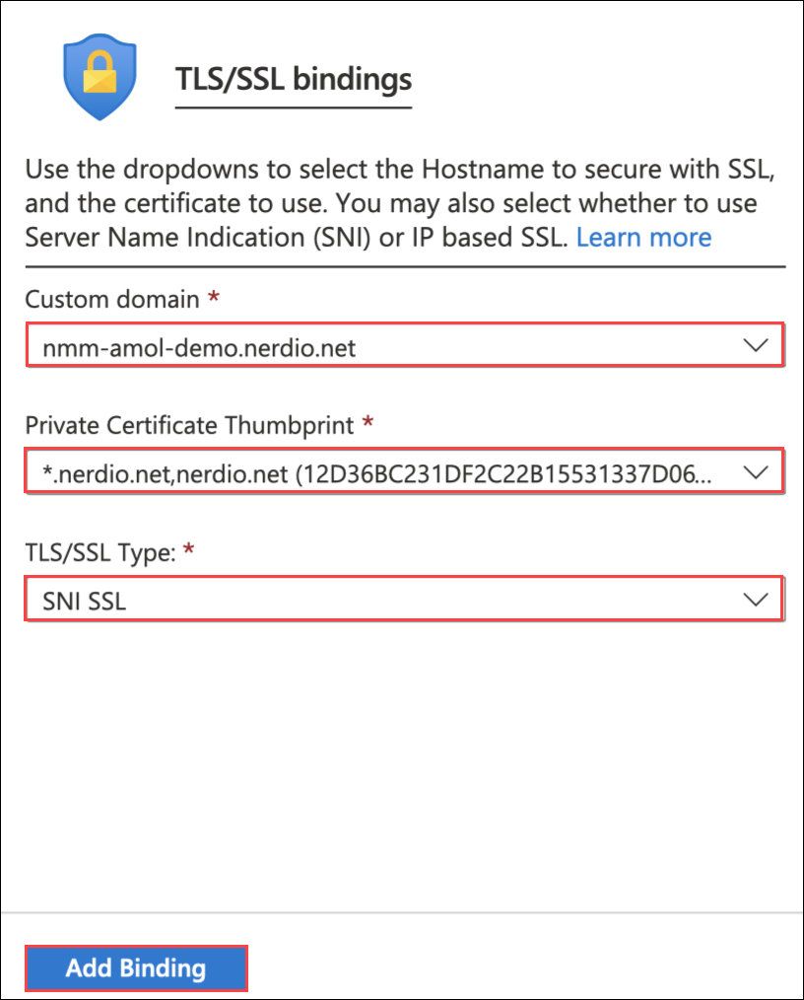
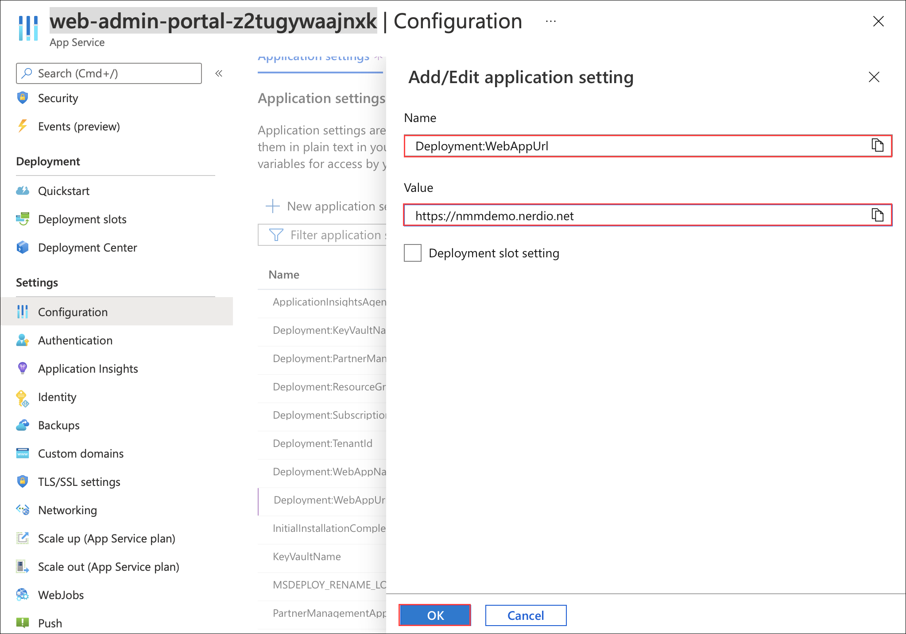

# Lab 6: Create Custom domain

## Overview

A custom domain is a unique branded label that's connected to the IP address of a website. To visit a particular site, you can type its custom domain name into the address bar of your browser. In this lab, you'll be creating a custom domain of an App Service through Azure portal.

## Exercise 1: Create Custom Domain

>**NOTE**: This Exercise is **Read-Only** exercise. Please do no perform the steps. Please go through the lab guide to understand the implementation.

1. On the **Azure portal** search for **Resource groups** in the search bar (1) and select **Resource groups** (2) from the suggestions.

   
   
1. Select **NMM-RESOURCES-RG** from the list of reosurce groups which is a dynamic RG created during creation NMM resource. It contains all the required resources.

   
   
1. Select the **App service** from the list of resources.

   
   
1. From **Settings** *(1)*, Select **Custom domains** *(2)* from the side blade. 

   
   
1. Copy the app service's default domain.

   

1. Create a new CNAME record in your domain's public DNS zone for the custom domain you want to add. (For example, nmm.mydomain.com). This CNAME record should point to the existing app's URL with the following configurations:

   - Record Type: CNAME
   - Name: nmm.mydomain.com
   - Value: the app service default URL
   - TTL: 1800 (or your preferred default)
   
1. Click on **Add custom domains** *(1)*. In **Add custom domains** pop up, Provide **nmm.mynerdio.com** *(2)* for custom domain option and click on **Validate** *(3)*.
   
   
   
1. After validation succeeds, click the **Add custom domain** button to finish adding the domain.
   
   
   
1. To ensure traffic to the new domain is secure, click **Add binding** under SSL binding:
   
   
   
1. Click **Upload PFX Certificate** to provide the export of your certificate file.

   
   
1. You may also purchase an SSL certificate through Azure, by navigating to the App Service's TLS/SSL Settings.

   
   
1. Once the certificate is uploaded, associate the new domain to the certificate and click "Add Binding" button.

   
   
1. Now navigate to Azure Active Directory, Select **App Registrations** and find the web admin portal application.  If your Web Admin Portal application is not shown, ensure "All Applications" is clicked.  This screen may default to **Owned Applications**.

1. In the menu on the left, select the **Authentication** tab. Under Redirect URIs, do not remove the original URL but do add URIs for your custom domain. Click "Save" option.

   >**NOTE**: if you do not see the Redirect URIs section, click "Add a platform" and select "Web." Then add the necessary Redirect URIs.

1. Click on Configuration, then Application Settings.

   
   
1. Find the setting for Deployment:WebAppUrl and change it to your custom domain (without the trailing slash). Click on **OK**.

   
   
1. Verify that your custom domain for NMM works by navigating to https://<your custom domain>/
