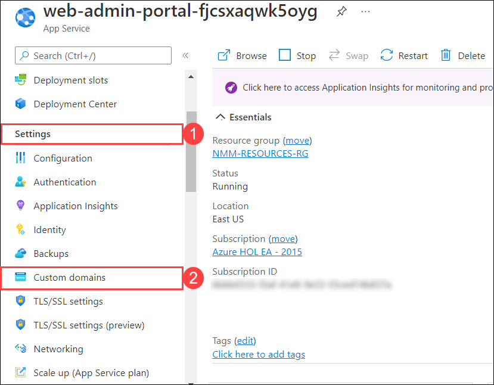
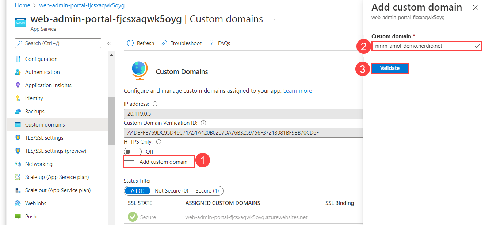

# Lab 6: Create Custom domain

## Overview

A custom domain is a unique branded label that's connected to the IP address of a website. To visit a particular site, you can type its custom domain name into the address bar of your browser. In this lab, you'll be creating a custom domain of an App Service through Azure portal.

## Exercise 1: Create Custom Domain

1. On the **Azure portal** search for **Resource groups** in the search bar (1) and select **Resource groups** (2) from the suggestions.

   
   
1. Select **NMM-RESOURCES-RG** from the list of reosurce groups which is a dynamic RG created during creation NMM resource. It contains all the required resources.

   
   
1. Select the **App service** from the list of resources.

   
   
1. From **Settings** *(1)*, Select **Custom domains** *(2)* from the side blade. 

   
   
1. Click on **Add custom domains** *(1)*. In **Add custom domains** pop up, Provide **nmm.mynerdio.com** *(2)* for custom domain option and click on **Validate** *(3)*.

   
   
   
