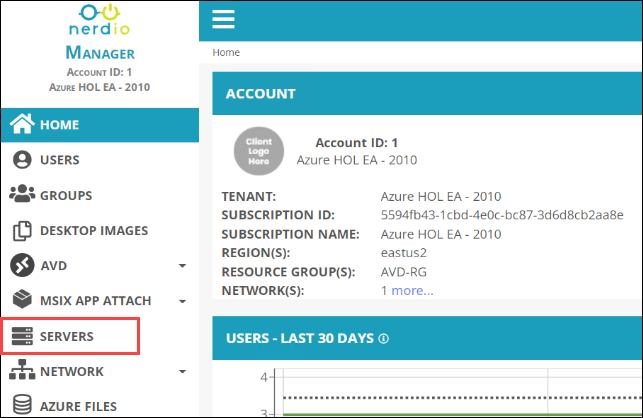
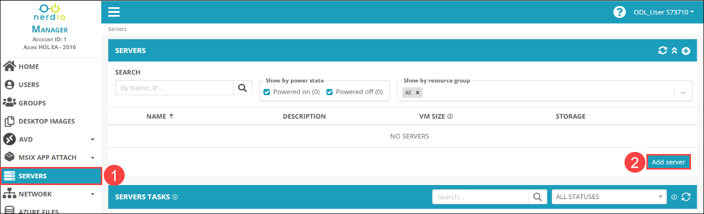
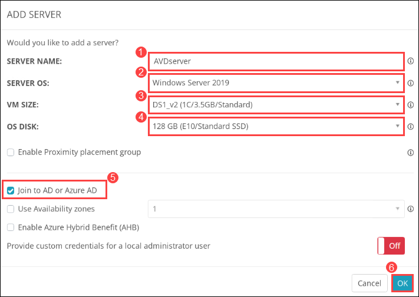
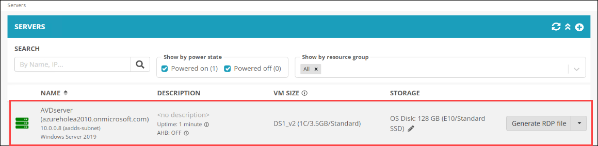

# Lab 6: Create server and application

# Skip this lab as its under development.

## Exercise 1: Create server instance

1. From the NMM portal, Click on **Accounts** ***(1)*** from the side blade and click on **Manage** ***(2)*** on your default NMM Account which you created in Lab 1.

   
   
1. Select **SERVERS** from the side blade.

   
   
1. From the **SERVERS** ***(1)*** page, Click on **Add server** ***(2)***.

   
   
1. In **ADD SERVER** window, Please provide the details mentioned below to create a new server machine.

   - **NAME**: *AVDserver (1)***
   - **AZURE IMAGE**: *Windows server 2019 (2)*
   - **VM SIZE**: *DS1_v2 (1C/3.5GB/Standard) (3)*
   - **OS DISK**: *128GB (E10/Standard SSD) (4)*
   - Check ***Join to AD*** ***(5)*
   - Click on ***OK*** ***(6)***
   
   
   
   >**NOTE**: Server machine task will take around 5 - 10 minutes to complete. Please wait till the task completes.
   
1. Once the creation completes, You'll be able see the new server in the **SERVERS** page.

   
