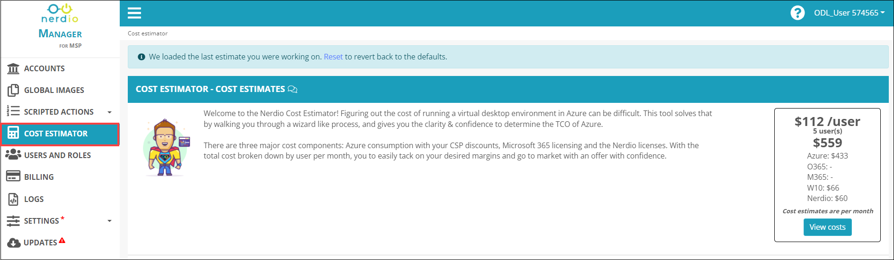
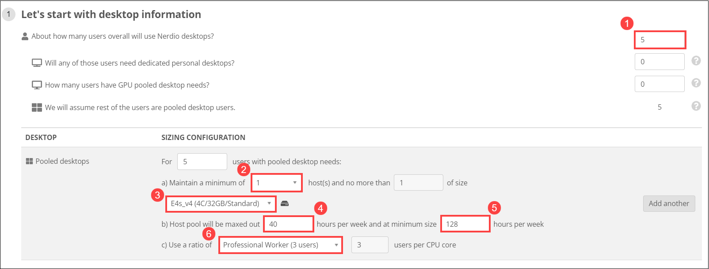
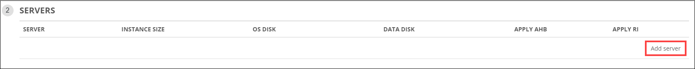
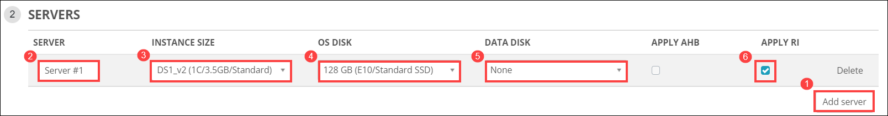
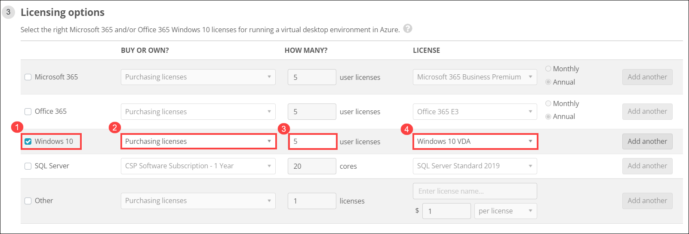
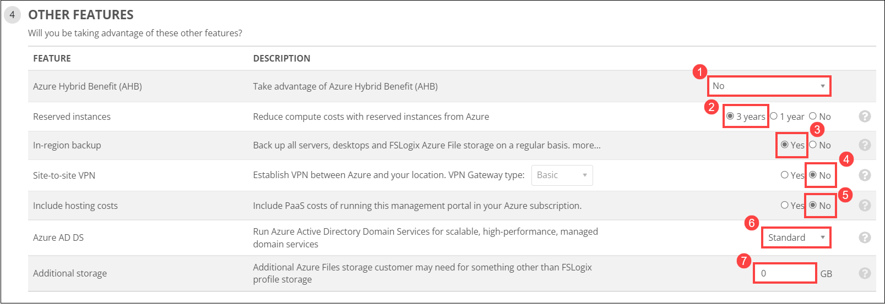
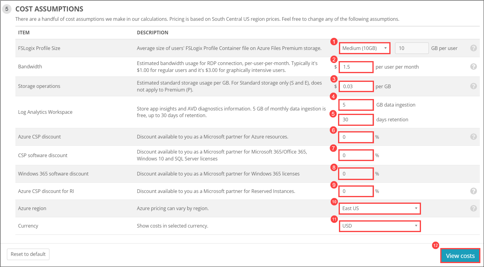
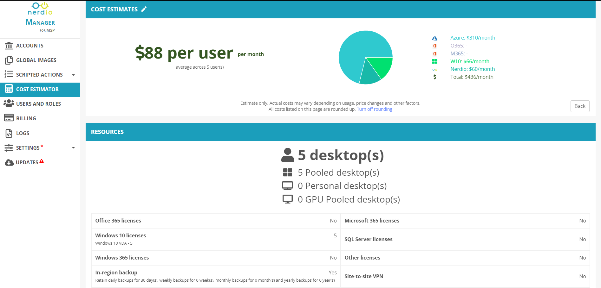
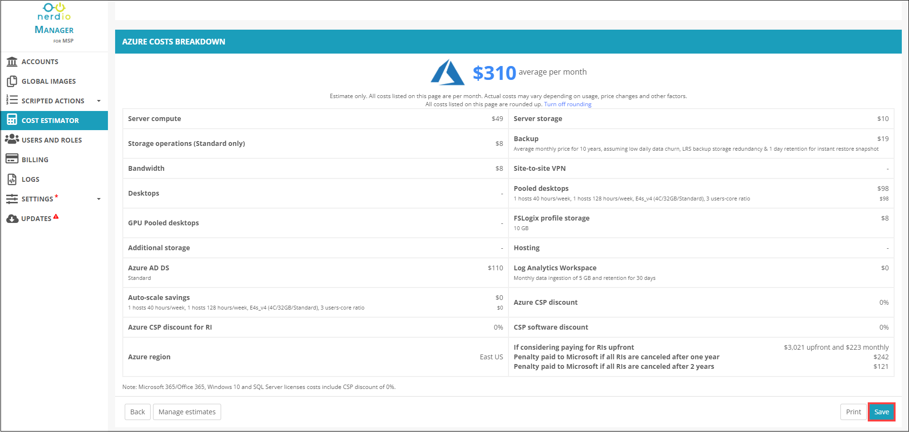
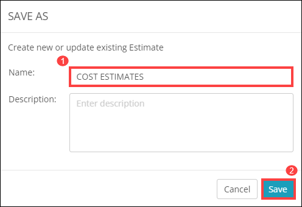

# Lab 9: Cost Estimator

1. From the NMM portal, click on **COST ESTIMATOR** *(1)* from the side blade and you will be redirected to the *COST ESTIMATOR - COST ESTIMATES* page.

   
   
1. In **STEP 1: Let's start with desktop information**, provide the following details.

   * **About how many users overall will use Nerdio desktops?**:  *5* *(1)* 
   * **Minimum number of host(s)**:  *1* *(2)*
   * **Size**:  *E4s_v4(4C/32GB/Standard)* *(3)*
   * **Maxed out host pool in hours per week**:  *40* *(4)*
   * **Maxed out host pool at minimum size in hours per week**:  *128* *(5)*
   * **Ratio of users per CPU**:  *Professional Worker (3 users)* *(6)*
   
   
   
1. In **STEP 2: SERVERS**, click on **Add server**.

   

   Provide the following details to add a server.
   
   * **SERVER**:  *Server #1* *(1)*
   * **INSTANCE SIZE**:  *DS1_v2(1C/3.5GB/Standard)* *(2)*
   * **OS DISK**:  *128 GB (E10/Standard SSD)* *(3)*
   * **DATA DISK**:  *None* *(4)*
   * **APPLY RI**:  *Yes* *(5)*

   
   
1. In **STEP 3: Licensing options**, provide the following details to assign licenses.

   * Select **Windows 10** *(1)*
   * **BUY OR OWN?**:  *Purchasing licenses* *(2)*
   * **HOW MANY?**:  *5* *(3)*
   * **LICENSE**:  *Windows 10 VDA* *(4)*
   
   
   
1. In **STEP 4: OTHER FEATURES**, provide the following details to add the other features.

   * **Azure Hybrid Benefit (AHB)**:  *No* *(1)*
   * **Reserved Instances**:  *3 years* *(2)*
   * **In-region backup**:  *Yes* *(3)*
   * **Site-to-site VPN**:  *No* *(4)*
   * **Include hosting costs**: *No* *(5)*
   * **Azure AD DS**: *Standard* *(6)*
   * **Additional storage**:  *0* *(7)*
   
   

1. In **STEP 5: COST ASSUMPTIONS**, provide the following details to assume further costs.

   * **FSLogix Profile Size**:  *Medium (10GB)* *(1)*
   * **Bnadwidth**:  *1.5* *(2)*
   * **Storage operations**:  *0.03* *(3)*
   * **Log Analytics Workspace**:  *5* *(4)* & *30* *(5)*
   * **Azure CSP discount**:  *0* *(6)*
   * **CSP software discount**:  *0* *(7)*
   * **Windows 365 software discount**:  *0* *(8)*
   * **Azure CSP discount for RI**:  *0* *(9)*
   * **Azure region**:  *East US* *(10)*
   * **Currency**:  *USD* *(11)*
   * Click on **View costs** *(12)* 
   
   
   
1. Once you click on *View costs*, you will be able to see **COST ESTIMATES**, **RESOURCES** and **AZURE COSTS BREAKDOWN** cost details. Click on **Save**.

   
   
   
   
1. In the **SAVE AS** page, name it as **COST ESTIMATES** *(1)* and click on **Save** *(2)*.

   

   
   
   
  
      
