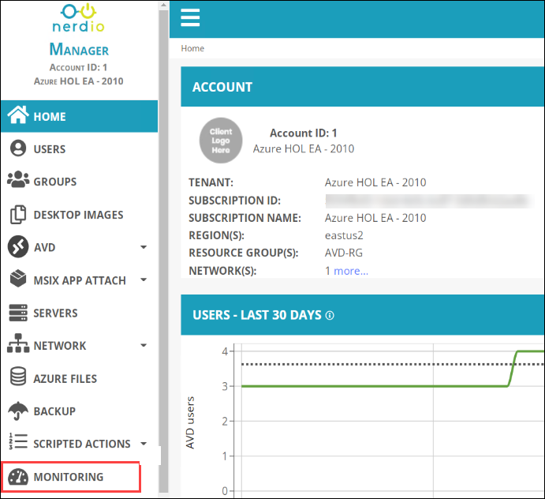
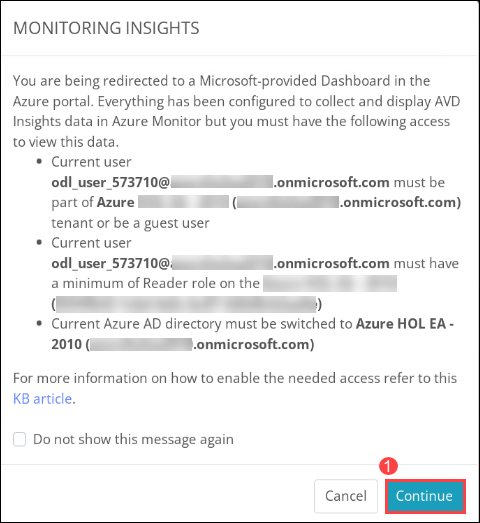
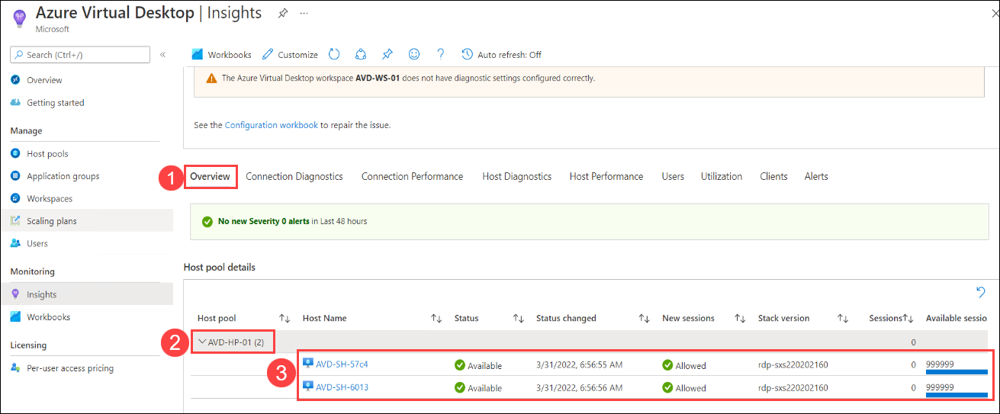
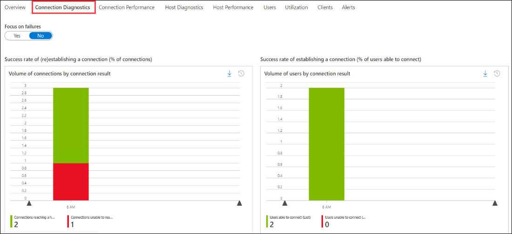
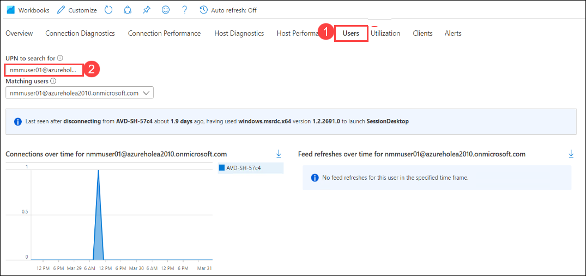
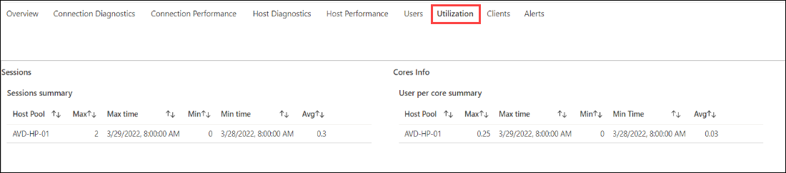
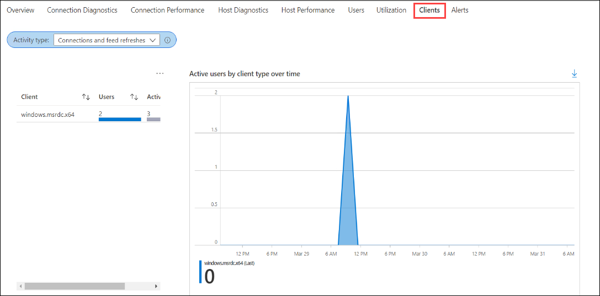

# Lab 10: Monitoring using Azure Monitor for AVD

## Overview

## Exercise 1: Access Azure Monitor using Nerdio Manager

1. From the NMM portal, Click on **Accounts** *(1)* from the side blade and click on **Manage** *(2)* on your default NMM Account which you created in Lab 1.

   
   
1. Select **Monitoring** from the side blade.

   
  
1. In Monitoring Insights redirection window, Click on **Continue** which will redirect you to AVD Insights page in Azure portal.

   
   
1. In **Insights** page, **Click** on **Overview** tab *(1)*. Here **expand** *(2)* the **EB-AVD-HP** host pool. You'll be able to monitor the status and health of the session hosts (3).

   
   
1. 1. **Click** on **Connection Diagnostics** tab, This tab gives information about Session connections and connectivity rate insights.

   
   
1. **Click** on **Users** *(1)* tab, In **UPN to search for** blank paste **<inject key="NMM User 01" />** *(2)* and wait for the data to load. This tab gives an overview of the user's usage. Scroll down and explore different information loaded.

   
   
1. 1. **Click** on **Utilization** tab, This tab gives information about sessions summary, cores info, and more information about the utilization of resources.

   
   
1. **Click** on **Clients** *(1)* tab, Here you'll be able to monitor the number of users connected to AVD using the browser and remote client application.

   
   
1. Spend some time on the page to explore different monitoring abilities offered by Azure Insights.
