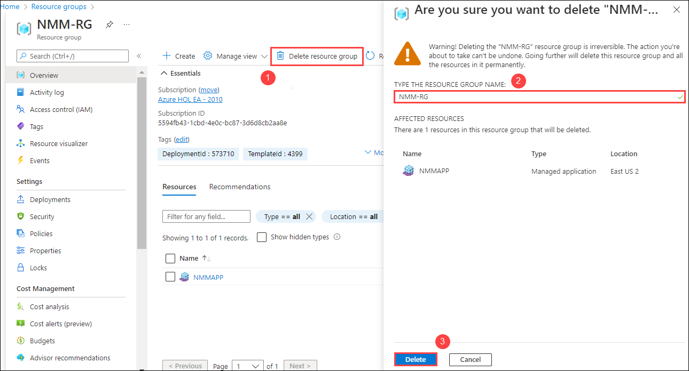

# Resource Clean up

1. From the Azure portal, click on **Resource Groups** present under *Navigate*.

   

1. You will see a list of resource groups as shown in the image below. Click on **NMM-RG** to open it.

   
   
1. Click on **Delete resource group** *(1)*, In **Are you sure you want to delete "NMM-RG"..** window, Provide the **RG Name** *(2)* and click on **Delete** *(3)*.

   

You have successfully completed the lab.
