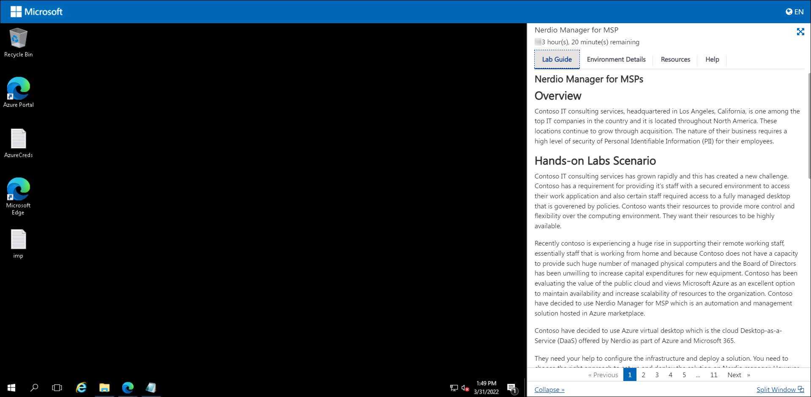
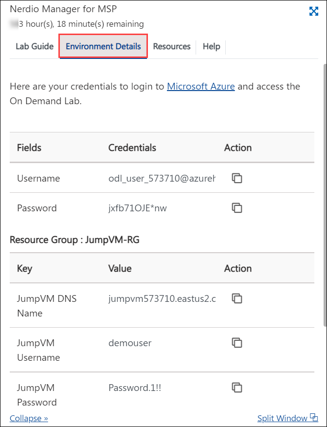
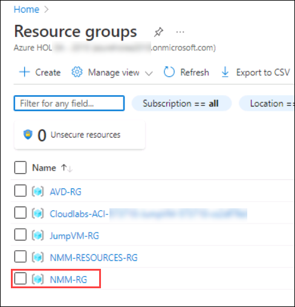

# Getting Started with Lab	

1. Once you launch the lab, a virtual machine (JumpVM) on the left and a lab guide on the right will get loaded in your browser. Use this virtual machine throughout the workshop to perform the lab.	

   	

2. To get lab environment details, click on the **Environment Details** tab located next to the *Lab Guide* tab. 	

   	

## Exercise 1: Log in to Azure Portal

1. In the JumpVM, double click on the **Azure portal shortcut** on the desktop.

     

2. Login to Azure with the username **<inject key="AzureAdUserEmail" />** and click on **Next**.

   

3. Enter password **<inject key="AzureAdUserPassword" />** and click on **Sign in**.

   

   >**Note:** If there's a popup entitled **Stay signed in?** with buttons for **No** and **Yes** - Choose **No**.
   
   
     
   >**Note:** If there's another popup entitled **Welcome to Microsoft Azure** with buttons for **Start Tour** and **Maybe Later** - Choose **Maybe Later**.
   
   >**Note:** If there's another popup entitled **Help us protect your account** click **Skip for now (14 days intil this is required)**
   
   
    
4. **Close** the recommendation page by clicking on the X mark.

   

4. Now in the Azure portal, click on **Resource Groups** present under *Navigate*.

   

5. You will see a list of resource groups as shown in the image below. Click on **NMM-RG** to open it.

   
   
Click on the Next button present in the bottom-right corner of this lab guide.

